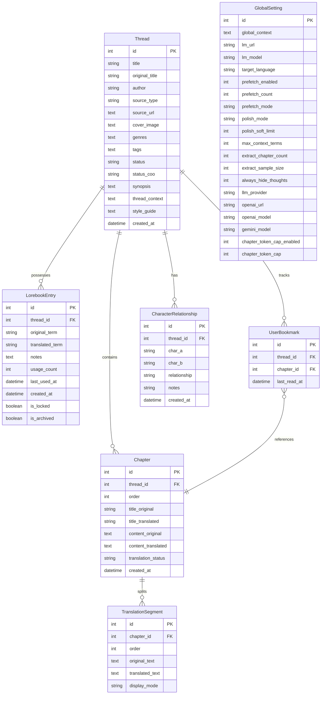
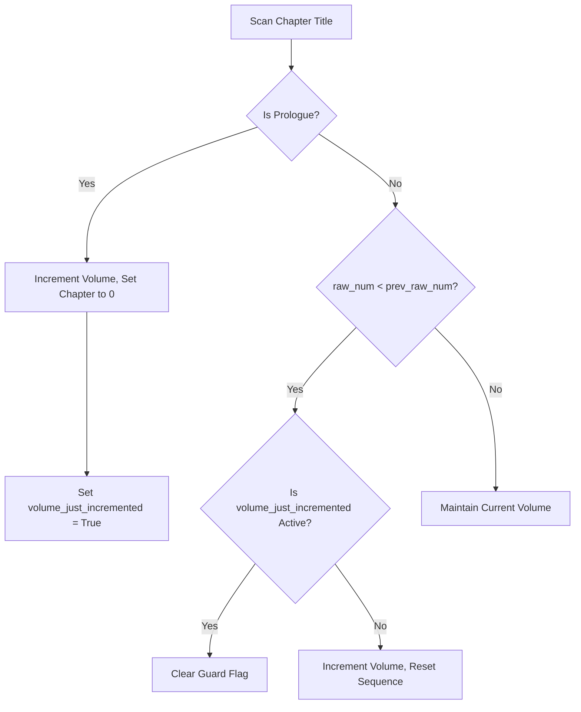

# 🌌 ReadOmni AI — Developer Handoff Blueprint

> **WELCOME, DEVELOPER/AGENT:** This document is your absolute source of truth. It has been meticulously updated to capture the entire system architecture, database models, technical boundaries, core pipeline lifecycles, and future expansion paths. By reading this file, you should understand the project fully and be ready to write high-impact code immediately.

---

## 🚀 1. Project Overview & Dev-Sandbox Setup

**ReadOmni AI** is a premium, self-hosted web novel reading and translation platform inspired by `app.readomni.com`. It features a sleek glassmorphic UI, sequential local AI background translation, a bulk translation dashboard, term auto-extraction, custom cover creators, and server-side synchronized configuration.

### 📋 The Technical Stack
* **Frontend:** React 19, Vite, TailwindCSS v4 (fully customized with HSL CSS variables supporting OLED, White, Sepia, Black, and Omni themes).
* **Backend:** FastAPI (Python 3.11+), SQLite (WAL mode enabled), SQLAlchemy ORM, Uvicorn server.
* **Scraper Engine:** Crawl4AI (stealth crawling) & dynamic parsing.
* **AI Core:** Swappable provider stack supporting LM Studio local OpenAI-compatible API (`http://localhost:1234`), OpenAI cloud models, Google Gemini cloud models, and OpenRouter AI (`https://openrouter.ai/api/v1`) with configurable per-chapter token safety caps, automatic thinking mode compatibility, multiple API key rotation, Quality/Fast translation mode, and auto-continue for truncated translations.

### 🔌 Sandbox Port Assignments
* **Vite Frontend:** `http://localhost:5173` (Staged to allow LAN sharing `--host` to read on mobile devices).
* **FastAPI Backend:** `http://localhost:8000` (Bound to `0.0.0.0` for multi-device sync).
* **LM Studio Local AI:** `http://localhost:1234` (OpenAI compatible REST endpoint).

---

## 📂 2. Directory Map & Component Roles

```text
├── backend/
│   ├── database.py             # SQLite database setup, WAL mode, SQLAlchemy ORM models (all tables)
│   ├── main.py                 # FastAPI app initialization, CORS middleware, router registration
│   ├── routers/
│   │   ├── batch.py            # Batch translation endpoints (start, status, stop)
│   │   ├── context.py          # Context extraction & glossary management
│   │   ├── discovery.py        # Novel discovery endpoints
│   │   ├── epub.py             # EPUB files uploading, unzipping, extraction & indexing
│   │   ├── export.py           # Premium book compiles (EPUB/TXT cover generator + selective exports)
│   │   ├── lorebook.py         # Thread-specific term dictionary CRUD & mappings
│   │   ├── polish.py           # Title polishing (NDJSON streaming, HARD/SOFT mode) & TOC skip logic
│   │   ├── relationships.py    # Character relationship graph extraction & D3 data
│   │   ├── scrape.py           # URL crawling interface using Crawl4AI
│   │   ├── settings.py         # Server-side persistent settings sync & API key management
│   │   ├── system.py           # Workspace switching (Ghost Mode) with PIN authentication (ADR-068)
│   │   ├── threads.py          # Thread/Chapter CRUD, delete chapter, fix-truncated, batch translation, metadata scraping
│   │   ├── toc.py              # TOC scraping & bulk chapter import pipeline (ADR-069)
│   │   ├── tools.py            # Utility endpoints (hallucination check, TXT/EPUB cleaners, cleanup preview)
│   │   └── translate.py        # Single chapter translation & streaming endpoints
│   ├── services/
│   │   ├── ai/
│   │   │   ├── base.py         # Abstract AI provider interface (streaming, non-streaming, truncation markers)
│   │   │   ├── factory.py      # Provider factory & model routing logic (Gemini/OpenAI/LM Studio)
│   │   │   ├── gemini.py       # Google Gemini adapter (thinking mode auto-disable, safety filters, content parsing)
│   │   │   ├── lm_studio.py    # LM Studio local adapter (localhost/127.0.0.1 fallback)
│   │   │   ├── openai.py       # OpenAI cloud adapter
│   │   │   ├── settings.py     # Active model/URL resolution, token cap calculation
│   │   │   └── secrets.py      # API key management, multi-key rotation, .env persistence, key rotation
│   │   ├── background_translator.py # Core queue, sequential prefetchers, batch worker, TOC detection, auto-continue
│   │   ├── cleaner_tools.py    # TXT/EPUB cleanup pipelines (ad detection, hallucination stripping)
│   │   ├── context_engine.py   # Translation prompt builder, lorebook auto-save, glossary enforcement
│   │   └── hallucination_detector.py # Garbled output detection, repeated word analysis, suspicious char patterns
│   └── tests/
│       ├── conftest.py         # Shared test fixtures (SQLite in-memory DB)
│       ├── test_routers/       # Router integration tests
│       └── test_services/      # Service unit tests (AI factory, settings)
├── src/
│   ├── components/             # Reusable UX controls
│   │   ├── BottomNav.tsx       # Mobile bottom navigation bar
│   │   ├── BulkStatusCenter.tsx # Live batch translation progress dashboard
│   │   ├── BulkTranslateModal.tsx # Batch translation configuration modal (Easy & Advanced modes, Quality/Fast toggle)
│   │   ├── EditCoverModal.tsx  # Dynamic HTML5 canvas drawing and base64 compression modal
│   │   ├── ExportModal.tsx     # Compilation controls, metadata forms, checklists
│   │   ├── Layout.tsx          # App shell layout with sidebar + content area
│   │   ├── RelationshipGraph.tsx # Interactive character relationship visualization (react-force-graph-2d)
│   │   ├── ScrapeNUModal.tsx   # Novel Updates & SFACG metadata scraper interface
│   │   ├── Sidebar.tsx         # Desktop sidebar navigation
│   │   ├── reader/
│   │   │   ├── ChapterGrid.tsx # Chapter grid with delete button & title polish actions
│   │   │   ├── ChapterReader.tsx # Chapter content display with markdown rendering
│   │   │   ├── ChapterListControls.tsx # Chapter list toolbar (bulk translate, polish, export)
│   │   │   ├── NovelHeader.tsx  # Novel title, cover, metadata display
│   │   │   └── SettingsOverlay.tsx # In-reader settings overlay
│   │   └── ui/                 # shadcn/ui primitives (Button, Card, etc.)
│   ├── hooks/
│   │   └── use-confirm.tsx # Custom confirmation dialog hook (Radix UI AlertDialog)
│   ├── pages/
│   │   ├── BrowseNovelPage.tsx # Novel discovery & SFACG scraping dashboard
│   │   ├── ContextLibraryPage.tsx # AI glossary extraction workstation (Easy & Advanced Modes)
│   │   ├── LibraryPage.tsx     # Rack bookshelf, reading history continue carousel, batch studios
│   │   ├── ReaderPage.tsx      # Immersive reader dual-pane (Split-screen translation workspace)
│   │   ├── SettingsPage.tsx    # Global variables dashboard (Themes, language, API keys, quality mode)
│   │   └── TranslatePage.tsx   # Quick single-URL import and translate page
│   ├── lib/                    # Utility functions (api.ts, utils.ts)
│   ├── index.css               # Central design tokens, variable scopes, animations
│   ├── App.tsx                 # React router / page switcher
│   └── main.tsx                # Client bootstrapper
└── docs/                       # Architectural Decision Records (ADR-004 through ADR-070)
```

---

## 💾 3. SQLite Database Models & Schemas

The system uses SQLite in **WAL (Write-Ahead Logging)** mode (activated via SQLAlchemy `event.listens_for` on connect) to handle simultaneous read/write actions safely across devices.



---

## ⚙️ 4. Core Subsystem Lifecycles & Workflows

### 🛡️ A. Stateful Volume Transition Bounds (ADR-027)
To prevent sequential numbering resets from causing "double-volume increments" (e.g. Volume 1 skipping to Volume 3), the backend tracks volume sweeps statefully:
1. **Explicit Prologue Matches:** The system scans chapter titles using regex and matches prologue keywords (`序章`, `楔子`, `prologue`, etc.). If matched:
   * Current volume increments cleanly.
   * Internal chapter index drops to `0`.
   * Sets `volume_just_incremented = True`.
2. **Double-Increment Protection:** If `volume_just_incremented` is active on chapter $n$, the sequential reset drop detector (`raw_num < prev_raw_num`) is suppressed on chapter $n+1$, giving the new sequence number space (e.g. Chapter 1) room to stabilize.



### 🎨 B. Dynamic Client-Side Cover Engine (ADR-019)
The visual bookshelf features an optimized multi-source cover pipeline:
* **canvas Compressor:** Staged inside `EditCoverModal.tsx`. When a user uploads a cover image from their system, it is painted onto a `300x400` Canvas (exact `3:4` ratio), converted to JPEG, compressed to `<100KB`, and saved as a lightweight Base64 string in the database.
* **Direct URL Image Link:** Supports fetching straight from online paths.
* **linear Seeded Gradient:** If no cover exists, the system hashes the book's title to produce a unique, aesthetically beautiful linear HSL gradient with a glassmorphic central initials badge.

### ⚡ C. Resilient Incremental Title Polishing (ADR-026 & ADR-024)
Large novels are polished in batches using a safe **Soft Load** mechanism (typically 100 chapters per request) to protect VRAM:
* **The Progression States:**
  * **Polish Titles** (0 titles polished): Initial sweep runs with `repolish=false`.
  * **Polish Remaining** (Some polished): Skip already translated titles and process the subsequent batch (e.g. 100–199, then 200–299) without looping back to Chapter 0.
  * **Reset & Re-polish All** (Manual Override): Located inside Polish Settings popover for manual force overwrites.

### 🐛 D. Desktop Navigation & Theme Persistence (ADR-028)
To resolve flickering navigation panels and broken Sepia/White themes on strict browsers:
* **Sidebar Simplification:** The sliding drawer pattern (`translate-x-full`) was entirely stripped from `Sidebar.tsx`. The mobile UI handles navigation purely through `BottomNav.tsx`, leaving `Sidebar.tsx` as a standard, bulletproof desktop-only element (`hidden md:flex`).
* **Tailwind v4 Variables:** The `index.css` global theme variables (`--background`, `--foreground`, etc.) were refactored to use the native Tailwind v4 `@theme` directive (e.g. `--color-background: var(--background);`).
* **Theme Specificity:** The `[data-theme="*"]` blocks were moved out of `@layer base` to ensure they have the absolute highest CSS specificity and cannot be overwritten by default dark mode or browser styles.
* **Auto-Dark Mode Mitigations:** Added `<meta name="color-scheme" content="light dark" />` and `<meta name="darkreader-lock" />` to `index.html` to prevent extensions like Dark Reader from forcefully inverting custom light themes. However, aggressive renderer-level features (like **Opera GX "Force Dark Pages"**) still require the user to manually disable the feature for this site to prevent color corruption.

### E. Batch Reliability & Global Progress UX (ADR-034)
Batch translation is a global background workflow, not a Library-only action.

* **Global Progress Surface:** `BulkStatusCenter` is mounted in `App.tsx` so progress stays visible while users move across Translate, Library, Context, Settings, and Reader detail/list views. It is intentionally hidden while reading an individual chapter to avoid covering the reading surface.
* **Controlled Navigation State:** `App.tsx` owns the active tab and passes it into `Layout`. Opening a book sets the active tab to Library, so returning from Reader lands back on Library instead of resetting to Translate.
* **Provider-Aware Model Routing:** `backend/services/ai/settings.py` resolves the active model/base URL from the selected provider. Gemini uses `gemini_model`, OpenAI uses `openai_model`, and LM Studio uses `lm_model`. Stale incompatible payloads such as qwen while Gemini is active are ignored.
* **Empty Stream Defense:** `BackgroundTranslator` retries an empty streaming response with non-streaming completion once. If the final cleaned translation is still empty, the chapter is marked `error`, not `done`.
* **Gemini Safety Blocks:** Provider content filters such as `content_filter: PROHIBITED_CONTENT` are treated as real per-chapter failures. Retry those chapters with LM Studio/local models or another provider rather than looping indefinitely.

### F. Configurable Chapter Token Safety Cap (ADR-035)
Long chapter translation now uses a configurable guardrail instead of a single hardcoded ceiling.

* **Global Toggle:** `chapter_token_cap_enabled` in `global_settings` turns the cap on or off for all chapter translation paths.
* **Preset Cap Values:** `chapter_token_cap` supports `7000`, `15000`, `22000`, and `30000` token presets. Current default is `22000`.
* **Scope:** Applies to manual chapter translate, re-translate, streaming chapter translate, background prefetch, and batch-per-chapter translation. It does not apply to title polish, glossary extraction, or metadata scraping.
* **Intent:** Reduce hallucination drift and wasted token burn on long chapter translations while preserving an uncapped escape hatch for power users with unusually large chapters.

### G. Markdown & HTML Rendering Support (ADR-038 + ADR-067)
Markdown and embedded HTML are supported natively in both the interactive Reader UI and the exported EPUBs.

* **Supported Markdown:** Bold (`**text**`), Italic (`*text*`), and Images (``).
* **HTML Image Tags (ADR-067):** Raw `` tags (common in SFACG chapters) are parsed and rendered as actual images. The regex splitter in `renderMarkdown()` extracts `src` and `alt` attributes and creates React `` elements. Relative paths are prefixed with `API_BASE`.
* **AI Preservation Rule:** The translation prompt in `context_engine.py` includes an explicit "HTML TAGS PRESERVATION" rule — AI must preserve `` tags exactly as-is during translation.
* **Implementation:** Lightweight regex-based parsing without heavy external AST dependencies.
* **EPUB Export:** `clean_html_content` injects `<strong>` and `<em>` tags directly into the EPUB HTML structure after necessary `< >` escaping.

### H. Mobile-Friendly Notifications & Confirmations (ADR-039)
The application avoids native `alert()` and `confirm()` dialogs to maintain a seamless, app-like experience (especially on mobile/PWA).

* **Passive Notifications:** `sonner` is used globally for toast notifications (`toast.success()`, `toast.error()`). The `<Toaster />` is mounted at the root in `App.tsx`.
* **Destructive Confirmations:** A custom hook `useConfirm()` (backed by Radix UI `AlertDialog`) allows imperative, awaitable confirmations.
  * *Usage:* `const isConfirmed = await confirm({ title: 'Delete?', description: 'Are you sure?', variant: 'destructive' });`
  * This prevents the need for local `isOpen` state management in every component that requires user confirmation.

### I. Fix Truncated Translations & Delete Chapter (ADR-046 follow-up)
Two quality-of-life endpoints for chapter management:

* **Fix Truncated** (`POST /api/threads/{id}/fix-truncated`): Scans all translated chapters in a thread. If a translation doesn't end with proper punctuation (`.!??"」』~*-)...`), it resets that chapter's translation to `idle` so it can be re-translated. Returns `{ "reset": <count> }`.
* **Delete Chapter** (`DELETE /api/threads/{id}/chapters/{chapter_id}`): Removes a single chapter and automatically re-orders remaining chapters to maintain sequential numbering. Available in the ChapterGrid UI via a delete button with confirmation dialog.

### J. Cloudflare & AI Safety Filter Handling (ADR-050)
Robust error handling for cloud-specific failures:

* **Cloudflare 403/503 Detection:** Scraper and AI endpoints detect Cloudflare challenge pages and report them as actionable errors rather than silent failures.
* **AI Content Filters:** Provider-level content blocks (e.g., Gemini's `PROHIBITED_CONTENT`) are treated as per-chapter hard failures, not infinite retry loops. Users are advised to switch providers for affected chapters.

### K. Swappable AI Provider Architecture (ADR-029 + ADR-030)
The AI subsystem uses a factory pattern for seamless provider switching:

* **`AIProviderFactory.get_provider()`** resolves the active provider from `GlobalSetting.llm_provider` and returns the appropriate adapter (LM Studio, OpenAI, or Gemini).
* **Gemini Model Normalization (ADR-030):** Popular shorthand names (e.g., `gemma-4-31b`, `gemini-3-flash`) are mapped to their correct API identifiers. Thinking mode is automatically disabled for incompatible models.
* **Multi-Key Rotation (`secrets.py`):** Multiple API keys per provider with automatic round-robin rotation and temporary exhaustion memory (keys that hit rate limits are excluded for a cooldown period).

### L. Workspace Switching — Ghost Mode (ADR-068)
A privacy feature that provides complete data isolation through dual SQLite databases:

* **Architecture:** Two physically separate databases (`main.db` and ghost workspace DB). All data (novels, translations, glossaries) is fully isolated.
* **PIN Protection:** Switching requires entering PIN `03697` via a long-press on the profile icon.
* **Safety:** `BackgroundTranslator.stop_all_batches()` is called before any switch to prevent in-flight translations from writing to the wrong database.
* **Endpoints:**
  * `GET /api/system/workspace/current` — returns current workspace
  * `POST /api/system/workspace` — switches workspace (requires PIN)

### M. TOC Scraper & Bulk Import Pipeline (ADR-069)
Two-phase novel onboarding from any web source:

* **Phase 1 — TOC Scraping** (`POST /api/threads/scrape-toc`): Accepts any URL and uses heuristic detection (link density, chapter URL patterns, Chinese chapter markers like 第X章) to extract chapter links. Auto-follows dedicated TOC pages when fewer than 50 chapters are found.
* **Phase 2 — Bulk Import** (`POST /api/threads/bulk-import-toc`): Creates Chapter records with URLs only — content is scraped lazily on-demand. For SFACG sources, novel metadata (author, synopsis, cover) is auto-fetched.
* **Deduplication:** Chapters whose URLs already exist in the thread are skipped.

### N. Streaming Polish via NDJSON (ADR-066)
The title polish endpoint was refactored from synchronous JSON to NDJSON streaming to prevent HTTP timeouts on large novels (1000+ chapters):

* **NDJSON Protocol:** Each chunk yields `{"status": "processing", "chunk": N, "total": M}`, final message is `{"status": "done", "count": X}`.
* **HARD vs SOFT Mode:** HARD mode skips inter-chunk delays for maximum throughput. SOFT mode retains 1-second delays to respect API rate limits.
* **Frontend Consumer:** `ReaderPage.tsx` reads the stream body via `ReadableStream` reader to keep the HTTP connection alive.

### O. Context Extraction Prompt Hardening (ADR-070)
The AI glossary extraction prompt and parser were hardened to improve entry quality:

* **Prompt Improvements:** 4 mandatory rules (context required, no generic descriptions, no trailing period after `)`, one entry per line), 3 good examples, 3 bad examples.
* **Parser Bug Fix:** `desc.rstrip('.!;,。！ ')` before `endswith(")")` check — fixes entries like `(context).` that previously failed to split `translated_term` from `notes`.
* **Per-Novel Style Guide:** Quality mode injects `thread.style_guide` (up to 1000 chars) into the translation prompt for novel-specific tone and style control.

---

## 🧪 5. Sandbox Quality Control & Verification

Every code change must adhere to the highest standard of type checking and compiler verification:
* **TSX Type Verification:** Run `npm run typecheck` (executes `tsc --noEmit`). No compilation errors are permitted.
* **ESLint:** Run `npm run lint` to verify zero linting errors across all `.tsx`/`.ts` files.
* **FastAPI Routers Syntax:** Run `py -m py_compile backend/routers/threads.py` (or any modified router) to assert syntax sanity.
* **Isolated TDD Specs:** Run test suites using Python unit tests (e.g. in `backend/scratch/test_context_engine.py`) built around in-memory SQLite instances to verify parsing logic safely.
* **WAL Mode Verification:** On startup, SQLite WAL mode is activated automatically via `database.py` event listener. Verify with `PRAGMA journal_mode` returning `wal`.
* **Frontend Gate Status:** As of ADR-035 follow-up, `npm run typecheck` and `npm run lint` both pass again after the reader controls and global token safety settings work landed.
* **Gemini Compatibility:** Thinking mode is automatically disabled for `gemini-2.5`, `gemini-3-flash`, and `gemini-3-pro` models to prevent 400 errors. Model normalization ensures popular models (gemma-4-31b, gemini-3-flash, etc.) resolve to their correct API identifiers.

---

## 📈 6. Future Expansion Roadmap & Your Immediate Tasks

Here are the immediate strategic features you are tasked to build next:

Recent completed platform work (ADR-034 through ADR-070):
- ADR-034: global batch progress visibility and honest chapter failure handling
- ADR-035: configurable chapter token safety cap with default `22K` and uncapped override
- ADR-036: hallucination audit system with 10x repeated-word detection and chapter-level flagging
- ADR-037: TXT/EPUB cleaner tool with cleanup preview and destructive apply workflows
- ADR-038: lightweight Markdown formatting support for Reader and EPUB builder
- ADR-039: mobile-friendly notification and dialog system replacing native alerts
- ADR-040: context capacity expansion (1000 terms) and character relationship visualizer
- ADR-041: target_lang enforcement in AI extraction to prevent wrong-language glossary terms
- ADR-042: UI library consolidation and component deduplication
- ADR-043: centralized settings state management across pages
- ADR-044: large component decomposition for maintainability
- ADR-045: formal test suite expansion with pytest fixtures
- ADR-046: translation auto-continue — detects truncated output and automatically continues until complete
- ADR-047: Quality/Fast translation mode — Quality mode for cloud (full glossary, style guide), Fast mode for local LLMs (10K token cap)
- ADR-048: cleanup logic hardening — improved ad detection, false chapter filtering, merge safety
- ADR-049: batch worker reliability — retry logic for rate limits (429/503), exponential backoff, empty stream defense
- ADR-050: Cloudflare and AI safety filter handling with actionable error messages
- ADR-051: core architecture documentation
- ADR-052: stability and batch optimization improvements
- ADR-053: context-aware glossary management with usage-based ranking
- ADR-054: configurable prefetch range for background translation
- ADR-055: mobile-responsive navigation with bottom nav bar
- ADR-056: chapter bookmarks with last-read tracking
- ADR-057: auto-fetch next web chapter on-demand
- ADR-058: background task garbage collection protection
- ADR-059: Novel Updates Cloudflare bypass via curl-cffi
- ADR-060: React UI reactivity via lastFetchedStatusRef pattern
- ADR-061: bulk fetch with RPM-aware key scaling
- ADR-062: temporary API key exhaustion memory with cooldown
- ADR-063: context engine glossary prompt fix (initial)
- ADR-064: local LLM context length safeguards
- ADR-065: UI performance with React.memo, react-virtuoso, and progressive rendering
- ADR-066: streaming polish via NDJSON — prevents HTTP timeout on 1000+ chapter novels
- ADR-067: HTML `` tag preservation in translation pipeline (extends ADR-038)
- ADR-068: workspace switching (Ghost Mode) with PIN-protected dual databases
- ADR-069: TOC scraper and bulk chapter import from any web source
- ADR-070: context extraction prompt hardening with good/bad examples and parser bug fix
- ADR-085: mobile screen sleep recovery via `sessionStorage` caching & `visibilitychange` wake listeners; continuous `displayMode` persistence
- ADR-086: text-only Gemini & Gemma model catalog refresh with updated RPM/RPD rate-limit delays
- ADR-087: garbage glossary entry filtering (`is_garbage_lorebook_entry`) in prompt builder and auto-save persistence
- ADR-088: real-time live batch translation event broadcasting (`batch-progress`) for 0ms chapter grid reactivity
- ADR-089: fixed desktop sidebar anchoring (`fixed top-0 left-0 h-screen`) and viewport-scoped mobile navigation (`md:hidden`)
- ADR-090: interactive library cover poster navigation and instant 1-click "Resume Reading" action button
- ADR-091: translation notes prompt instruction alignment, automatic glossary slash-splitting sanitization, and robust empty-translation detection
- Fix truncated translations endpoint (`POST /api/threads/{id}/fix-truncated`) with Library menu button
- Delete chapter endpoint (`DELETE /api/threads/{id}/chapters/{chapter_id}`) with automatic re-ordering
- TOC page skip in title polish — auto-detects Table of Contents pages (5+ chapter indicators in <5000 chars) and skips polishing
- Gemini thinking mode auto-disable for incompatible models (gemini-2.5, gemini-3-flash, gemini-3-pro)

### 1. GGUF Model Cache & Local Model Store
* **Goal:** Allow users to download and change LLM translation models directly from the reader panel (storing local paths).
* **Files to Extend:**
  * `backend/routers/context.py` (Add model list schemas to GlobalSettingsUpdate).
  * `src/pages/SettingsPage.tsx` (Add model download dashboards).

### 2. Dynamic Reader Drawer Layout Options
* **Goal:** Complete customized styles including custom user fonts uploads, adjustable paragraph gaps, line-height limits, and custom column layouts.
* **Files to Extend:**
  * `src/pages/ReaderPage.tsx` (Incorporate variables into the settings sliding drawer).

---

*Now that you are up to speed with the entire architecture, schemas, and guardrails, dive in and craft beautiful, production-ready code! Good luck!*
