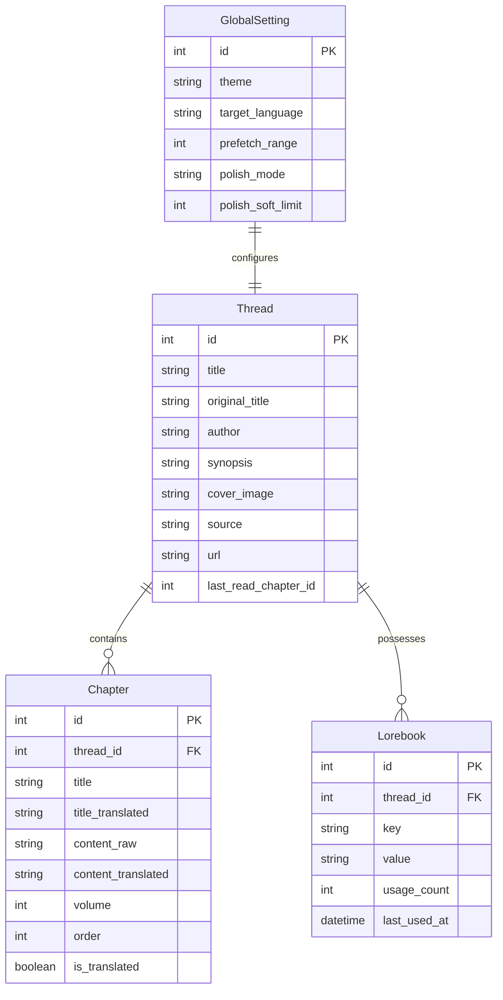
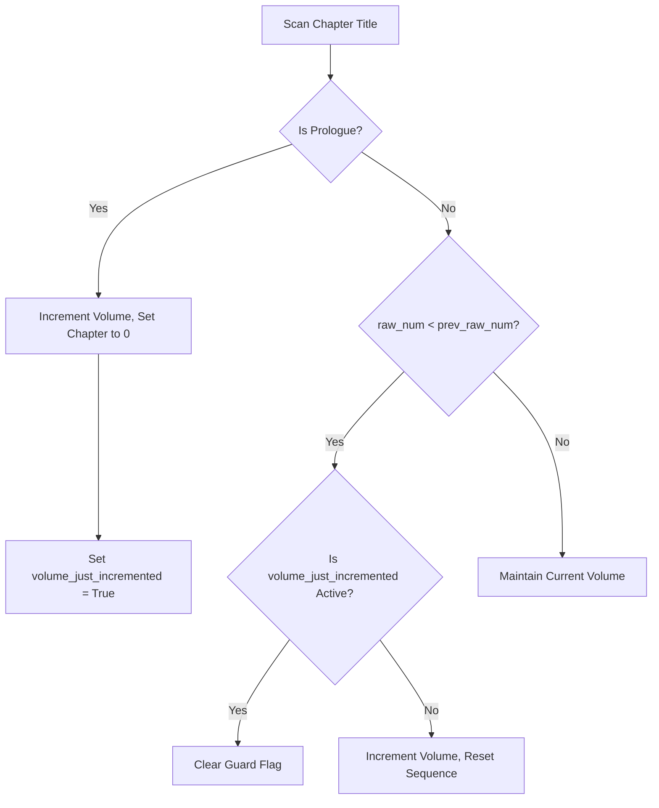

# 🌌 ReadOmni AI — Developer Handoff Blueprint

> **WELCOME, DEVELOPER/AGENT:** This document is your absolute source of truth. It has been meticulously updated to capture the entire system architecture, database models, technical boundaries, core pipeline lifecycles, and future expansion paths. By reading this file, you should understand the project fully and be ready to write high-impact code immediately.

---

## 🚀 1. Project Overview & Dev-Sandbox Setup

**ReadOmni AI** is a premium, self-hosted web novel reading and translation platform inspired by `app.readomni.com`. It features a sleek glassmorphic UI, sequential local AI background translation, a bulk translation dashboard, term auto-extraction, custom cover creators, and server-side synchronized configuration.

### 📋 The Technical Stack
* **Frontend:** React 19, Vite, TailwindCSS v4 (fully customized with HSL CSS variables supporting OLED, White, Sepia, Black, and Omni themes).
* **Backend:** FastAPI (Python 3.11+), SQLite (WAL mode enabled), SQLAlchemy ORM, Uvicorn server.
* **Scraper Engine:** Crawl4AI (stealth crawling) & dynamic parsing.
* **AI Core:** LM Studio API (Local mock-OpenAI running at `http://localhost:1234`).

### 🔌 Sandbox Port Assignments
* **Vite Frontend:** `http://localhost:5173` (Staged to allow LAN sharing `--host` to read on mobile devices).
* **FastAPI Backend:** `http://localhost:8000` (Bound to `0.0.0.0` for multi-device sync).
* **LM Studio Local AI:** `http://localhost:1234` (OpenAI compatible REST endpoint).

---

## 📂 2. Directory Map & Component Roles

```text
├── backend/
│   ├── database.py             # SQLite database setup, engine activation, WAL mode configuration
│   ├── main.py                 # FastAPI app initialization, middleware configurations, error overrides
│   ├── models.py               # SQLAlchemy Database schemas (Threads, Chapters, Lorebook, Settings)
│   ├── routers/
│   │   ├── batch.py            # Studio Bulk translations (Soft/Hard processing logic)
│   │   ├── epub.py             # EPUB files uploading, unzipping, extraction & indexing
│   │   ├── export.py           # Premium book compiles (EPUB cover generator + selective exports)
│   │   ├── lorebook.py         # Thread-specific term dictionary CRUD & mappings
│   │   ├── scrape.py           # URL crawling interface using Crawl4AI
│   │   └── settings.py         # Server-side persistent settings sync (GlobalSetting table)
│   ├── services/
│   │   ├── background_translator.py # Core queue, title polishing sweeps, sequential prefetchers
│   │   ├── context_engine.py   # AI terminology extraction, prompts, lorebook token limits
│   │   └── epub_exporter.py    # EPUB container compiler and metadata packager
│   └── scratch/                # Developer isolated testing playground and TDD specs
├── src/
│   ├── components/             # Reusable UX controls
│   │   ├── EditCoverModal.tsx  # Dynamic HTML5 canvas drawing and base64 compression modal
│   │   ├── ExportModal.tsx     # Compilation controls, metadata forms, checklists
│   │   └── ScrapeNUModal.tsx   # Crawl4AI parser interface (Scrapes synopsis, metadata, cover links)
│   ├── pages/
│   │   ├── ContextLibraryPage.tsx # AI glossary extraction workstation (Easy & Advanced Modes)
│   │   ├── LibraryPage.tsx     # Rack bookshelf, reading history continue carousel, batch studios
│   │   ├── ReaderPage.tsx      # Immersive reader dual-pane (Split-screen translation workspace)
│   │   └── SettingsPage.tsx    # Global variables dashboard (Themes, language, prefetch range)
│   ├── index.css               # Central design tokens, variable scopes, animations
│   └── main.tsx                # Client bootstrapper
└── docs/                       # Architectural Decision Records (ADRs 001 to 027)
```

---

## 💾 3. SQLite Database Models & Schemas

The system uses SQLite in **WAL (Write-Ahead Logging)** mode to handle simultaneous read/write actions safely across devices.



---

## ⚙️ 4. Core Subsystem Lifecycles & Workflows

### 🛡️ A. Stateful Volume Transition Bounds (ADR-027)
To prevent sequential numbering resets from causing "double-volume increments" (e.g. Volume 1 skipping to Volume 3), the backend tracks volume sweeps statefully:
1. **Explicit Prologue Matches:** The system scans chapter titles using regex and matches prologue keywords (`序章`, `楔子`, `prologue`, etc.). If matched:
   * Current volume increments cleanly.
   * Internal chapter index drops to `0`.
   * Sets `volume_just_incremented = True`.
2. **Double-Increment Protection:** If `volume_just_incremented` is active on chapter $n$, the sequential reset drop detector (`raw_num < prev_raw_num`) is suppressed on chapter $n+1$, giving the new sequence number space (e.g. Chapter 1) room to stabilize.



### 🎨 B. Dynamic Client-Side Cover Engine (ADR-019)
The visual bookshelf features an optimized multi-source cover pipeline:
* **canvas Compressor:** Staged inside `EditCoverModal.tsx`. When a user uploads a cover image from their system, it is painted onto a `300x400` Canvas (exact `3:4` ratio), converted to JPEG, compressed to `<100KB`, and saved as a lightweight Base64 string in the database.
* **Direct URL Image Link:** Supports fetching straight from online paths.
* **linear Seeded Gradient:** If no cover exists, the system hashes the book's title to produce a unique, aesthetically beautiful linear HSL gradient with a glassmorphic central initials badge.

### ⚡ C. Resilient Incremental Title Polishing (ADR-026 & ADR-024)
Large novels are polished in batches using a safe **Soft Load** mechanism (typically 100 chapters per request) to protect VRAM:
* **The Progression States:**
  * **Polish Titles** (0 titles polished): Initial sweep runs with `repolish=false`.
  * **Polish Remaining** (Some polished): Skip already translated titles and process the subsequent batch (e.g. 100–199, then 200–299) without looping back to Chapter 0.
  * **Re-polish All** (All polished): Clears translations and processes a clean full sweep.
  * **Reset & Re-polish All** (Manual Override): Located inside Polish Settings popover for manual force overwrites.

---

## 🧪 5. Sandbox Quality Control & Verification

Every code change must adhere to the highest standard of type checking and compiler verification:
* **TSX Type Verification:** Run `npm run typecheck` (executes `tsc --noEmit`). No compilation errors are permitted.
* **FastAPI Routers Syntax:** Run `py -m py_compile backend/routers/threads.py` to assert syntax sanity.
* **Isolated TDD Specs:** Run test suites using Python unit tests (e.g. in `backend/scratch/test_context_engine.py`) built around in-memory SQLite instances to verify parsing logic safely.

---

## 📈 6. Future Expansion Roadmap & Your Immediate Tasks

Here are the immediate strategic features you are tasked to build next:

### 1. AI Character Relationship Clustering & Visualizer
* **Goal:** Detect key narrative figures, track character interactions via chapter occurrences, and draw a dynamic interactive relationship network diagram inside the Lorebook page.
* **Files to Extend:**
  * `backend/services/context_engine.py` (Add a graph-node entity extractor).
  * `src/pages/ContextLibraryPage.tsx` (Implement a SVG network graph visualizer using D3 or canvas).

### 2. GGUF Model Cache & Local Model Store
* **Goal:** Allow users to download and change LLM translation models directly from the reader panel (storing local paths).
* **Files to Extend:**
  * `backend/routers/settings.py` (Add model list schemas).
  * `src/pages/SettingsPage.tsx` (Add model download dashboards).

### 3. Dynamic Reader Drawer Layout Options
* **Goal:** Complete customized styles including custom user fonts uploads, adjustable paragraph gaps, line-height limits, and custom column layouts.
* **Files to Extend:**
  * `src/pages/ReaderPage.tsx` (Incorporate variables into the settings sliding drawer).

---

*Now that you are up to speed with the entire architecture, schemas, and guardrails, dive in and craft beautiful, production-ready code! Good luck!*
