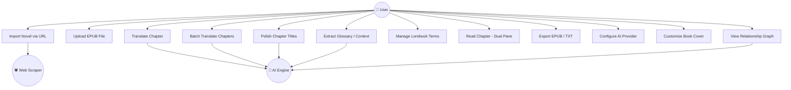
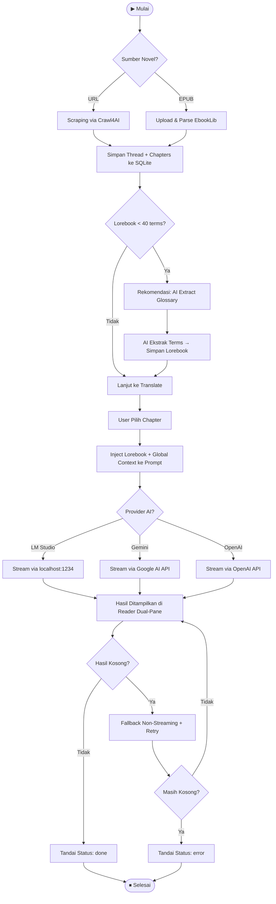
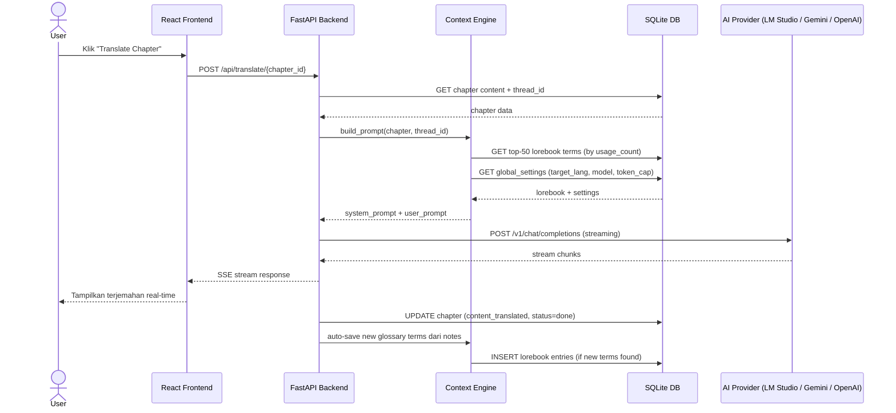
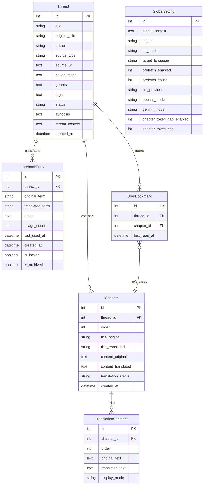

# SDLC — AI Translator Web (ReadOmni Clone)

> **Terakhir diperbarui:** 23 Mei 2026  
> **Status Aktif:** ✅ Phase 16 — Hallucination Cleanup, Markdown Support & Mobile UX (Complete)  
> **Lihat rencana detail:** [`docs/implementation_plan.md`](./implementation_plan.md)

---

## 1. Planning & Analysis

**Goal:** Self-hosted web app untuk membaca dan menerjemahkan web novel & EPUB menggunakan AI lokal.

**Fitur Inti:**
1. Web Scraping (URL → Markdown bersih via Crawl4AI)
2. EPUB Management (Upload → per-chapter parsing)
3. AI Translation (via LM Studio lokal, `localhost:1234`)
4. Context/Lorebook Memory (term consistency per thread)

**Tech Stack:**
| Layer | Teknologi | Alasan |
|:---|:---|:---|
| Frontend | React 19 + Vite + TailwindCSS v4 | Sudah diinisialisasi, cepat |
| Backend | Python 3.11 + FastAPI | Ecosystem AI/ML terbaik |
| Scraping | Crawl4AI | Output Markdown bersih, LLM-friendly |
| EPUB | EbookLib (Python) | Presisi parsing per chapter |
| Database | SQLite (SQLAlchemy) | Ringan, cukup untuk self-hosted |
| AI | LM Studio (OpenAI-compatible API) | Self-hosted, privacy |

**Target Platform:** Web — Responsive / Mobile-first.

---

## 2. Design

**Arsitektur:** Client-Server.
- Frontend React memanggil FastAPI backend via REST.
- FastAPI mengorkestrasi Crawl4AI, EbookLib, dan LM Studio.

**UI/UX:**
- Klon visual ReadOmni (glassmorphism, sidebar nav, dark mode).
- Design tokens didefinisikan di [`docs/style.md`](./style.md).

---

## 2a. Use Case Diagram

Diagram berikut menggambarkan interaksi utama antara aktor dan sistem ReadOmni AI.

---

## 2b. Activity Diagram — Alur Terjemahan Chapter

Diagram berikut menggambarkan alur lengkap dari import novel hingga chapter selesai diterjemahkan.

---

## 2c. Sequence Diagram — Translasi Chapter (Single)

Diagram berikut menggambarkan interaksi antar komponen saat user mentranslasi satu chapter.

---

## 2d. Entity Relationship Diagram (Database Schema)

---

## 3. Implementation Phases

| Phase | Fokus | Status |
|:---|:---|:---|
| **Phase 1** | Foundation: Design system, Backend setup, DB schema | ✅ Selesai |
| **Phase 2** | Core: UI Shell, Scraping, EPUB, API connect | ✅ Selesai |
| **Phase 3** | Translation: Lorebook Engine, AI Etik Enforcement | ✅ Selesai |
| **Phase 4** | Automation: Auto-save, Glossary Extraction Loop | ✅ Selesai |
| **Phase 5** | UI/UX Overhaul: Omni-Sepia & Background Persistence | ✅ Selesai |
| **Phase 6** | Navigation: Bulk Title Translation & Navigation Polish | ✅ Selesai |
| **Phase 7** | **Stability & Quality**: Chunking, Husky Removal, AbortController | ✅ Selesai |
| **Phase 8** | Advanced Monitoring & Performance | ✅ Selesai |
| **Phase 9** | Premium Book Export (EPUB/TXT) | ✅ Selesai |
| **Phase 10** | **Batch Translation Studio** | ✅ Selesai |
| **Phase 11** | **TDD & Code Quality Verification** | ✅ Selesai |
| **Phase 12** | **Custom Book Cover Personalization** | ✅ Selesai |
| **Phase 13** | **Infinite Polish & Scraped Author Integration** | ✅ Selesai |
| **Phase 14** | **Batch Reliability & Global Progress UX** | ✅ Selesai |
| **Phase 15** | **Configurable Chapter Token Safety Cap** | ✅ Selesai |
| **Phase 16** | **Hallucination Cleanup, Markdown Support & Mobile UX** | ✅ Selesai |

## Phase 1: Foundation (COMPLETE)
- **Goal**: Membangun fondasi arsitektur backend, skema basis data, dan design system frontend yang seragam.
- **Implementation**: Inisialisasi FastAPI, database SQLite/SQLAlchemy, dan TailwindCSS v4 dengan design tokens (ADR-001).
- **Status**: Finished.

## Phase 2: Core Features (COMPLETE)
- **Goal**: Mendukung pengimporan novel melalui web scraping dan pemrosesan file EPUB lokal.
- **Implementation**: Mengintegrasikan Crawl4AI untuk scraping aman dan parser EbookLib untuk split bab EPUB (ADR-002, ADR-003).
- **Status**: Finished.

## Phase 3: Lorebook Engine (COMPLETE)
- **Goal**: Menjamin konsistensi istilah terjemahan antar bab menggunakan glosarium per-thread.
- **Implementation**: Sistem CRUD database untuk Lorebook, injeksi dinamis glosarium ke context window LLM lokal, dan sensor etika AI (ADR-004, ADR-005).
- **Status**: Finished.

## Phase 4: Automation & Auto-Save (COMPLETE)
- **Goal**: Mempercepat alur pembacaan melalui fitur simpan otomatis dan pendeteksi glosarium otomatis.
- **Implementation**: Logika deteksi peristilahan otomatis saat membaca bab baru, penambahan cepat entri lorebook (ADR-009, ADR-010).
- **Status**: Finished.

## Phase 5: UI/UX Overhaul & Background Persistence (COMPLETE)
- **Goal**: Overhaul visual bertema premium (Omni, Sepia, OLED) dan migrasi data setting ke server-side database.
- **Implementation**: CSS variable themes (style.md) di frontend, table `global_settings` di database SQLite backend untuk multi-device sync (ADR-006, ADR-008).
- **Status**: Finished.

## Phase 6: Navigation & Title Polish (COMPLETE)
- **Goal**: Mendukung penerjemahan massal judul-judul bab novel berukuran besar dan menghilangkan kedipan visual.
- **Implementation**: BackgroundTasks asinkron untuk penerjemahan judul massal (ADR-007) dan optimalisasi UX rendering bab di ReaderPage.
- **Status**: Finished.

## Phase 7: Stability & Reliability Guardrails (COMPLETE)
- **Goal**: Mencegah kegagalan batch, race conditions, dan throttling GPU lokal.
- **Implementation**: Pembatasan batch chunking 50 judul, jeda 1.0s, HTTP timeout 300s, pembersihan Husky git hooks, dan integrasi `AbortController` (ADR-011).
- **Status**: Finished.

## Phase 8: Advanced Monitoring & Performance (COMPLETE)
- **Goal**: Visibilitas status background task, prefetching bab latar belakang sekuensial cerdas.
- **Implementation**: Rentang prefetching 1-5 bab dikonfigurasi server-side, indikator visual status bab ("Prefetched", "Translating...") di sidebar, polling progres dinamis 5s (ADR-013).
- **Status**: Finished.

## Phase 9: Premium Book Export (COMPLETE)
- **Goal**: Memungkinkan ekspor hasil terjemahan novel ke format buku e-reader premium (EPUB/TXT) dengan metadata dan sampul kustom.
- **Implementation**: Service Python EPUB exporter, Upload cover Base64, dan antarmuka seleksi bab di modal glassmorphism (ADR-014).
- **Status**: Finished.

## Phase 10: Batch Translation Studio (COMPLETE)
- **Goal**: Dasbor sentral pemrosesan batch terjemahan massal dengan mitigasi konsistensi (AI Extract First).
- **Implementation**: Batch Studio Workspace dengan mode Mudah/Lanjutan, visualisasi status Center, deteksi lorebook <40 entri untuk rekomendasi ekstraksi AI (ADR-015).
- **Status**: Finished.

## Phase 11: TDD & Code Quality Verification (COMPLETE)
- **Goal**: Menjamin keandalan logika pembersihan teks, parser AI, dan meminimalkan warning serta error di frontend/backend.
- **Implementation**: Unit test mandiri `test_context_engine.py` menggunakan in-memory SQLite, standardisasi stream stdout di Windows `main.py`, dan pembersihan 100% eslint & typescript compile errors (ADR-018).
- **Status**: Finished.

## Phase 12: Custom Book Cover Personalization (COMPLETE)
- **Goal**: Menghadirkan kustomisasi sampul buku premium menggunakan upload gambar base64 yang dikompresi secara lokal, link URL langsung, dan linear gradient fallback visual yang dinamis.
- **Implementation**: Canvas-based local compressor di frontend, SQLite schema auto-migration untuk field `cover_image` di backend, hash HSL generator berdasarkan judul buku, serta sinkronisasi visual pada rak buku dan komidi putar riwayat baca (ADR-019).
- **Status**: Finished.

## Phase 13: Infinite Polish & Scraped Author Integration (COMPLETE)
- **Goal**: Mengotomatiskan ekstraksi dan integrasi metadata penulis dari platform Novel Updates & SFACG serta menstabilkan proses pembersihan judul orisinil.
- **Implementation**: Web scraping selectors untuk penulis, integrasi SQLAlchemy dan schema mapping, prefill nama penulis orisinil di modal ekspor EPUB/TXT, zero-padded formatting untuk penomoran bab yang rapi, dan transisi pengaturan mode soft/hard load (ADR-023, ADR-024, ADR-025).
- **Status**: Finished.

## Phase 14: Batch Reliability & Global Progress UX (COMPLETE)
- **Goal**: Membuat batch translation lebih jujur, tahan terhadap empty stream/provider safety block, dan progress-nya tetap terlihat global saat user berpindah halaman.
- **Implementation**: Validasi hasil akhir batch agar chapter kosong tidak pernah ditandai `done`, fallback non-streaming saat stream Gemini kosong, resolver provider-aware untuk model/base URL, `BulkStatusCenter` global di `App.tsx`, dan tab Library dipertahankan saat kembali dari Reader (ADR-034).
- **Status**: Finished.

## Phase 15: Configurable Chapter Token Safety Cap (COMPLETE)
- **Goal**: Mengurangi hallucination drift dan token burn pada terjemahan chapter panjang tanpa mengunci user ke satu batas keras.
- **Implementation**: Tambah global toggle chapter token safety cap, preset `7K/15K/22K/30K`, default `22K`, mode uncapped saat toggle dimatikan, wiring backend `max_tokens` ke jalur translate chapter, update Settings UI, dan sinkronisasi ADR-035.
- **Status**: Finished.

## Phase 16: Hallucination Cleanup, Markdown Support & Mobile UX (COMPLETE)
- **Goal**: Membersihkan output AI yang garbled/hallucinated, mendukung Markdown formatting di reader dan EPUB, meningkatkan UX mobile dengan notifikasi non-native, serta memperluas kapasitas context dan visualisasi relasi karakter.
- **Implementation**:
  - **ADR-036:** Automated detection dan cleanup pola hallucination umum (karakter acak, pengulangan, garbled Chinese) dari konten chapter yang sudah diterjemahkan.
  - **ADR-037:** Pipeline cleaning TXT per-thread dengan live preview modal sebelum user commit ke ekspor file.
  - **ADR-038:** Lightweight regex-based Markdown parser (`**bold**`, `*italic*`) di Reader UI (`renderMarkdown`) dan EPUB exporter (`<strong>`/`<em>` injection).
  - **ADR-039:** Ganti semua native `alert()`/`confirm()` dengan `sonner` toast dan custom `useConfirm()` hook berbasis Radix UI `AlertDialog`.
  - **ADR-040:** Lorebook term limit diperluas hingga 1000 terms dengan granular preset, ditambah Character Relationship Graph berbasis `react-force-graph-2d` + D3.
  - **ADR-041:** Semua jalur AI extraction (thread context, glossary, relationships) kini menerima dan menginjeksi `target_lang` ke system prompt, mencegah notes ditulis dalam bahasa sumber.
- **Status**: Finished.

---

## 4. Testing

- **Automated Unit Tests**: Unit test suites `backend/scratch/test_context_engine.py` berjalan secara otomatis untuk memvalidasi parser catatan penerjemah, pembersihan markdown horizontal rule, dan aturan minimum panjang glosarium.
- **API test:** Semua endpoint via FastAPI Swagger UI (`/docs`).
- **UI test:** Chrome DevTools — viewport 375px (mobile), 1280px (desktop).
- **Linter test**: Enforced `npm run lint` dan compiler verification untuk build 100% bersih (`npm run typecheck`).
- **Flicker test**: Rapid navigation check via ReaderPage.
- **Backend syntax check**: `py -m py_compile backend/routers/<router>.py` untuk setiap router yang dimodifikasi.
- **WAL Mode Verification**: Pada startup, SQLite WAL mode diaktifkan otomatis via `database.py` event listener. Verifikasi dengan `PRAGMA journal_mode` yang mengembalikan `wal`.

---

## 5. Deployment

- Self-hosted di mesin lokal (atau Docker).
- LM Studio harus berjalan di port `1234` sebelum backend distart.
- Akses mobile via LAN IP (contoh: `192.168.1.x:5173`).

---

## Catatan Developer

- Frontend ada di `/src`, jalankan dengan `npm run dev`.
- Backend ada di `/backend`, jalankan dengan `py -m uvicorn main:app --reload --host 0.0.0.0`.
- **Penting**: Konfigurasi LM Studio kini disimpan di **Server-Side Database** (table `global_settings`), bukan lagi localStorage.
